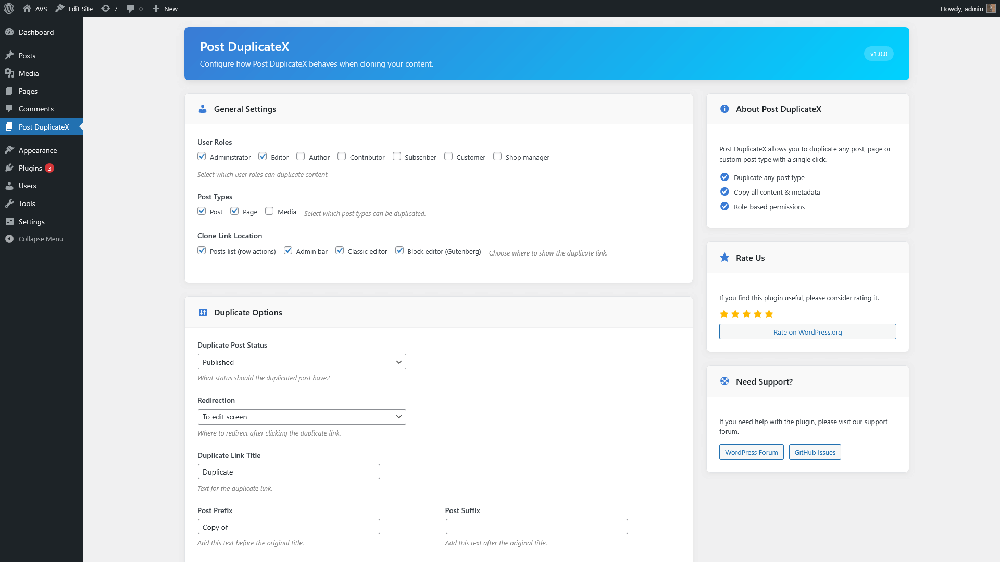
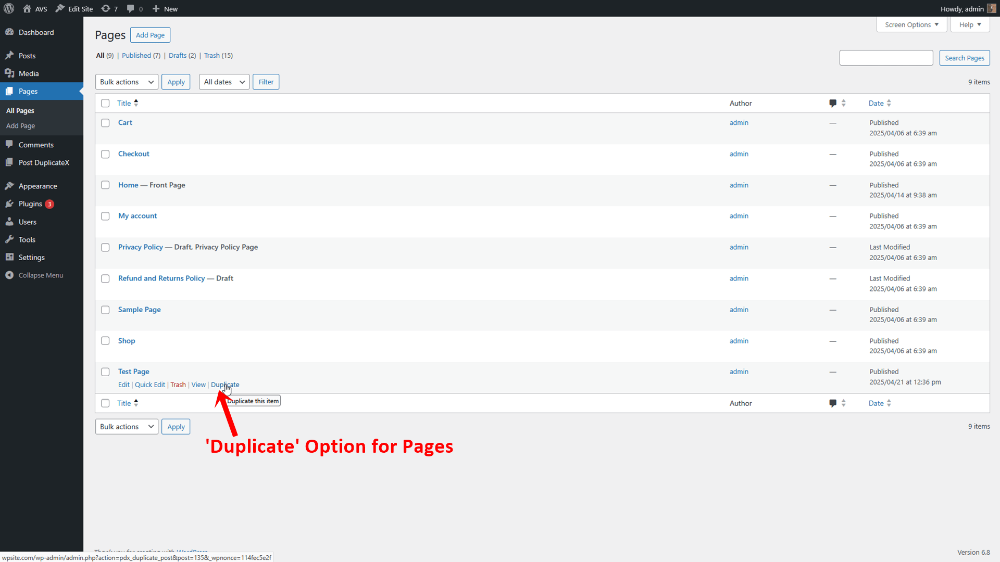
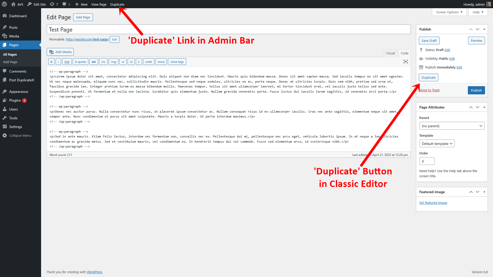
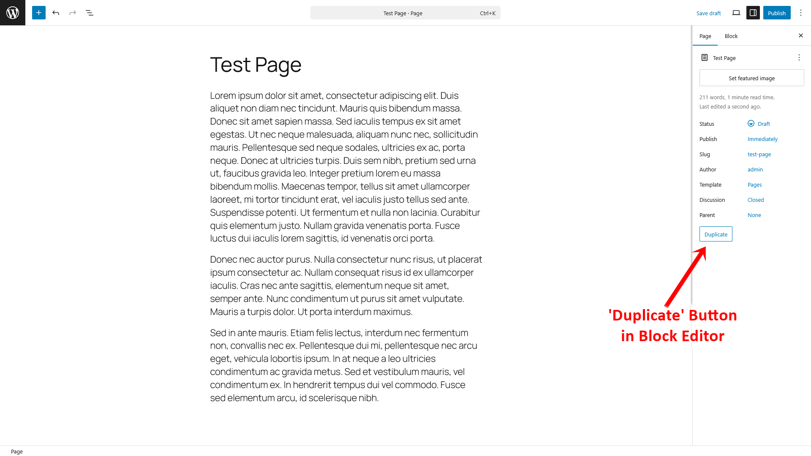

# Post DuplicateX

**Post DuplicateX** is a powerful WordPress plugin that enables one-click duplication of posts, pages, and custom post types with extensive customization options.

## Features

- **Universal Duplication**: Clone any posts, pages, or custom post types with a single click
- **Flexible Publication Status**: Save duplicates as draft, published, private, or pending review
- **Multiple Duplication Points**: 
  - Post/page list row actions
  - Admin toolbar
  - Classic editor
  - Block editor (Gutenberg)
- **Role-Based Access Control**: Define which user roles can duplicate content
- **Custom Post Type Support**: Enable duplication for any public custom post type
- **Title Customization**: Add prefixes and suffixes to duplicated content titles
- **Smart Redirection**: Choose where users are redirected after duplication
- **Complete Content Cloning**: Copies all custom fields, taxonomies, and featured images

## Installation

### From WordPress Admin

1. Go to **Plugins > Add New**
2. Search for "Post DuplicateX"
3. Click "Install Now" then "Activate"
4. Go to **Post DuplicateX** in the admin menu to configure settings

### Manual Installation

1. Download the plugin zip file
2. Go to **Plugins > Add New > Upload Plugin**
3. Upload the zip file
4. Click "Activate"
5. Go to **Post DuplicateX** in the admin menu to configure settings

## Usage

After installation and activation:

1. Navigate to **Post DuplicateX** in the WordPress admin menu
2. Configure your preferences:
   - Select which user roles can duplicate content
   - Choose which post types to enable for duplication
   - Select where duplicate links/buttons should appear
   - Set the default status for duplicated posts
   - Configure title prefixes/suffixes
   - Choose the redirection behavior
3. Start duplicating content using the links/buttons that appear in your selected locations

## Screenshots

| Settings Page | Post List View |
|:---:|:---:|
|  |  |

| Classic Editor | Block Editor |
|:---:|:---:|
|  |  |

## Configuration Options

### User Roles
Control which user roles have permission to duplicate content:
- Administrator
- Editor
- Author
- Contributor
- Custom roles

### Post Types
Select which content types can be duplicated:
- Posts
- Pages
- Any custom post type (Products, Projects, etc.)

### Link Locations
Choose where duplicate links/buttons should appear:
- Post/page list rows
- Admin toolbar
- Classic editor
- Block editor

### Post Status
Set the default status for duplicated content:
- Draft
- Published
- Private
- Pending review

### Additional Options
- **Redirection**: Control where users go after duplication
- **Link Title**: Customize the text for the duplicate link/button
- **Post Prefix**: Add text before the duplicated post title
- **Post Suffix**: Add text after the duplicated post title

## Frequently Asked Questions

### Does this work with Gutenberg?
Yes, Post DuplicateX fully supports the block editor with a dedicated button in the post sidebar.

### Will it duplicate all custom fields and taxonomies?
Yes, the plugin duplicates all post meta data, taxonomies, categories, and tags.

### Is it compatible with page builders?
Yes, Post DuplicateX works with all major page builders including Elementor, Divi, Beaver Builder, etc.

## Contributing

Contributions are welcome! Please feel free to submit a Pull Request.

1. Fork the repository
2. Create your feature branch (`git checkout -b feature/amazing-feature`)
3. Commit your changes (`git commit -m 'Add some amazing feature'`)
4. Push to the branch (`git push origin feature/amazing-feature`)
5. Open a Pull Request

## License

This project is licensed under the GPL v3 - see the [LICENSE](LICENSE) file for details.

## Acknowledgments

- Thanks to all contributors and users of Post DuplicateX
- Icon made by [Freepik](https://www.flaticon.com/authors/freepik) from [www.flaticon.com](https://www.flaticon.com/)